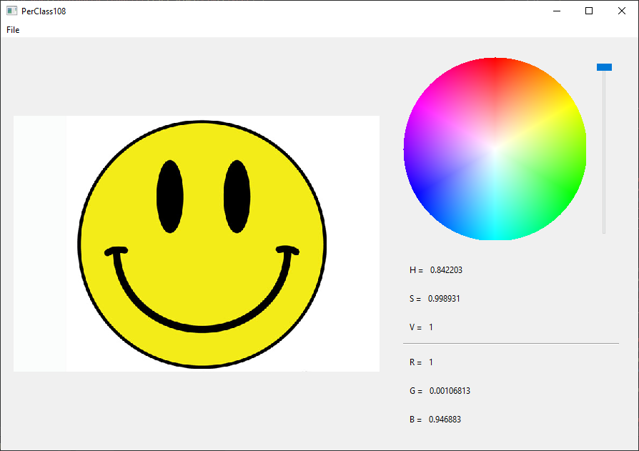

# PerClass108  

> A Qt application for a tech interview question

PerClass108 is a Qt6 application I whipped together one weekend in Aug 2021. I
was given a basic spec to make a Qt application that:

- Shows a color image loaded from a file
- Contains a custom widget that shows HSV color space (can be fixed to one V)
- Shows a live position in HSV when mousing over the image

Apart from building/integrating Qt projects, I've never written a Qt app before,
so I had to learn Qt while doing this. Therefore, the Qt code might be a bit crap.

- Prints HSV and RGB out into `QLabel`s
- Prompts the user for the file with a file dialog
- Supports drag & drop into the UI

# Building

I didn't have time to write a build pipeline for building this on a clean CI
machine. I can confirm that it builds directly in QtCreator 4.14.2 on Windows. The
code is only dependent on Qt and the C++ standard library, so there's a high chance
that it will build on other systems (that have Qt) fairly straightforwardly.
